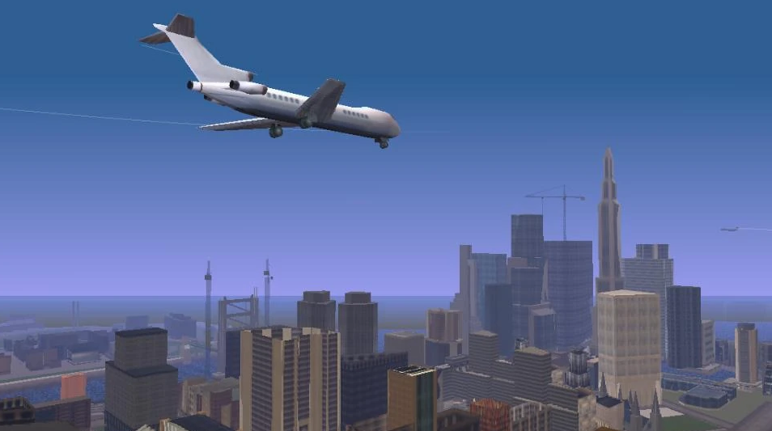

# Staunton Island

## Introducción
Staunton Island representa el corazón financiero y político de Liberty City. A diferencia de la decadente Portland, este distrito está lleno de rascacielos, parques bien cuidados y una arquitectura moderna que refleja poder, riqueza y corrupción institucional.

## 🏢 Diseño Urbano de Staunton Island en Liberty City (GTA III)
Staunton Island representa el corazón financiero y político de Liberty City. A diferencia de la decadente Portland, este distrito está lleno de rascacielos, parques bien cuidados y una arquitectura moderna que refleja poder, riqueza y corrupción institucional.

## 🗺️ Estructura y Barrios Principales
Staunton Island está dividido en varios sectores que reflejan distintas funciones urbanas:

**Bedford Point:** Zona de negocios con rascacielos, oficinas corporativas y el Liberty Memorial Coliseum. Es el centro económico del distrito.

**Belleville Park:** Área residencial de clase alta con espacios verdes, ideal para paseos y encuentros con personajes clave.

**Newport:** Barrio comercial con tiendas, casinos y tráfico constante. Aquí se encuentra el famoso Kenji’s Casino.

**Torrington y Rockford:** Sectores financieros y administrativos, con presencia de bancos, edificios gubernamentales y sedes de medios como Rise FM.

**Aspatria y Fort Staunton:** Áreas más periféricas, con instalaciones deportivas y zonas en reconstrucción tras eventos narrativos del juego.

## 🚦 Infraestructura y Movilidad
**Puente Callahan:** Conecta Staunton con Portland, desbloqueado tras avanzar en la historia.

**Túnel Porter:** Une Staunton con Shoreside Vale, facilitando el acceso al último distrito.

**Calles amplias y avenidas:** A diferencia de Portland, Staunton tiene un trazado más ordenado, con avenidas que permiten una conducción más fluida.

**Transporte público:** Aunque no funcional en el juego, existen estaciones de metro y tren que refuerzan la ambientación urbana.

## 🌆 Estética y Ambientación
**Diseño visual:** Fachadas de vidrio, iluminación nocturna y arquitectura vertical dominan el paisaje.

**Sonido ambiental:** Tráfico constante, sirenas, música electrónica y diálogos corporativos crean una atmósfera de ciudad activa y despiadada.

## 🎭 Función Narrativa
Staunton Island representa el ascenso del protagonista en el mundo criminal. Aquí se enfrentan mafias más sofisticadas como los Yakuza, los Carteles Colombianos y los agentes corruptos del gobierno. Las misiones en este distrito son más complejas y peligrosas, reflejando el cambio de escala en la historia.

Staunton Island es el contraste perfecto con Portland: moderno, ambicioso y lleno de secretos. Su diseño urbano no solo enriquece la jugabilidad, sino que también refuerza la narrativa de poder y traición que define GTA III.